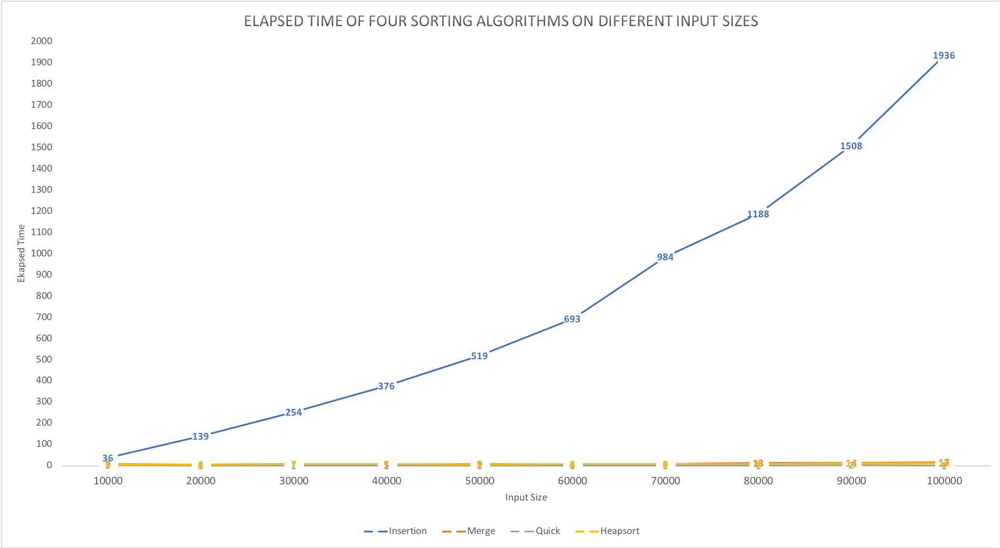
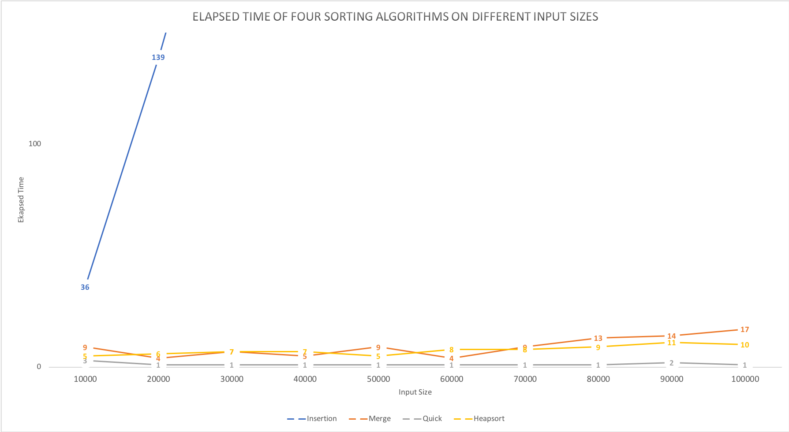

# Homework 9

Sorting Algorithms
---
The following four algorithms were tested with 10 different input sizes composed of *n* random numbers between 1-1,000,000: insertionsort, mergesort, quicksort, and heapsort.

Each input size was composed of *n* random numbers and used as input for each algorithm, comparing execution elapsed time between all algorithms.

Results
---
Sample output of a run. Values will differ between each run, but the trends are similar.

|  | 10000 | 20000 | 30000 | 40000 | 50000 | 60000 | 70000 | 80000 | 90000 | 100000 | Average (ms)
| :------------- | :-------------: | :-------------: | :-------------: | :-------------: | :-------------: | :-------------: | :-------------: | :-------------: | :-------------: | :-------------: | :-------------: |
| Insertion | 36 | 139 | 254 | 376 | 519 | 693 | 984 | 1188 | 1508 | 1936 | 763.3 |
| Merge | 9 | 4 | 7 | 5 | 9 | 4 | 9 | 13 | 14 | 17 | 9.1 |
| Quick | 3 | 1 | 1 | 1 | 1 | 1 | 1 | 1 | 2 | 1 | 1.3 |
| Heapsort | 5 | 6 | 7 | 7 | 5 | 8 | 8 | 9 | 11 | 10 | 7.6 |

#### Graph

\newpage
#### Closeup

Discussion
---
These algorithms have the following average running times:

| Sorting Algorithm | Running Time (Average) |
| :-------------    | :-------------         |
| Insertion         | O(n^2)                 |
| Merge             | O(n log n)             |
| Quick             | O(n log n)             |
| Heap              | O(n log n)             |

We can see that our experiments support these notions.

Insertion sort is by-far the most drastic, due to its quadratic running time, its elapsed time increases really fast as the input size increases, with an average elapsed time of **763.3 ms**. Clearly, it is not a good choice for sorting a large number of elements. Merge and Heap sort have elapsed times very close to each other, with average elapsed times of **9.1 ms** and **7.6 ms**, respectively. Quick sort is definitely consistently much faster than all four, and its elapsed running times stayed fairly consistent through every increased input size, with an average elapsed time of **1.3 ms**. I expected it to vary a little more, but it is clear that quick sort is the most efficient algorithm between these four.

The theoretical running time calculations are supported by real-life experimental runs on each algorithm. Elapsed running times show insertion sort's inefficiency on large number of elements and quick sort's consistently low running time independent of input size. We can also see that merge and heap sort work well on the smaller and medium sized inputs, and progressively get worse (to a much smaller degree than insertion sort, but a greater degree than quick sort) as the input size becomes larger.
